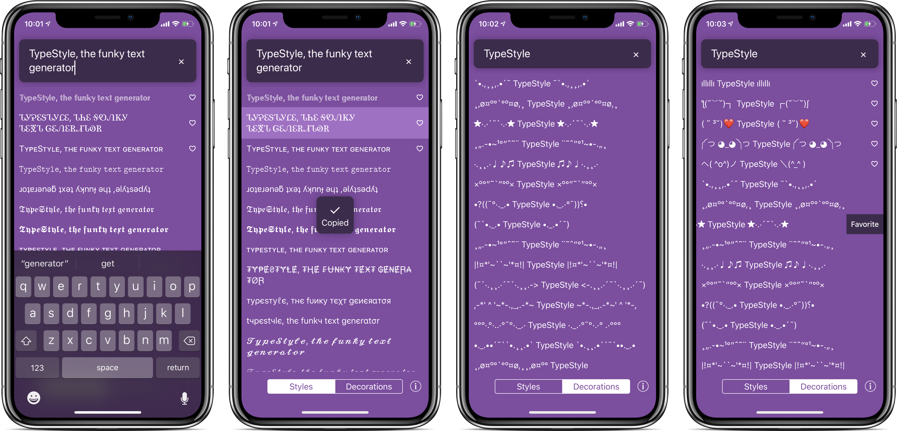

# TypeStyle

[TypeStyle](https://typestyle.app/) is a handy app for iPhone and iPad that generates text using different styles and decorations. It is a native Swift iOS app.

## Features

* Fun styles like 𝔗𝔥𝔦𝔰, 𝕋𝕙𝕚𝕤, and even sıɥʇ
* Expressive decorationsl like ¸,ø¤º°°º¤ø,¸ This ¸,ø¤º°°º¤ø,¸
* Favorite your top styles to pin them to the top
* One-click copy to your clipboard
* iPad [Drag and Drop](https://developer.apple.com/ios/drag-and-drop/) support

## Getting started

1. Install [CocoaPods](http://cocoapods.org/).
2. Run `pod install` in the root folder of the repository.
5. Open `TypeStyle.xcworkspace` in Xcode.
